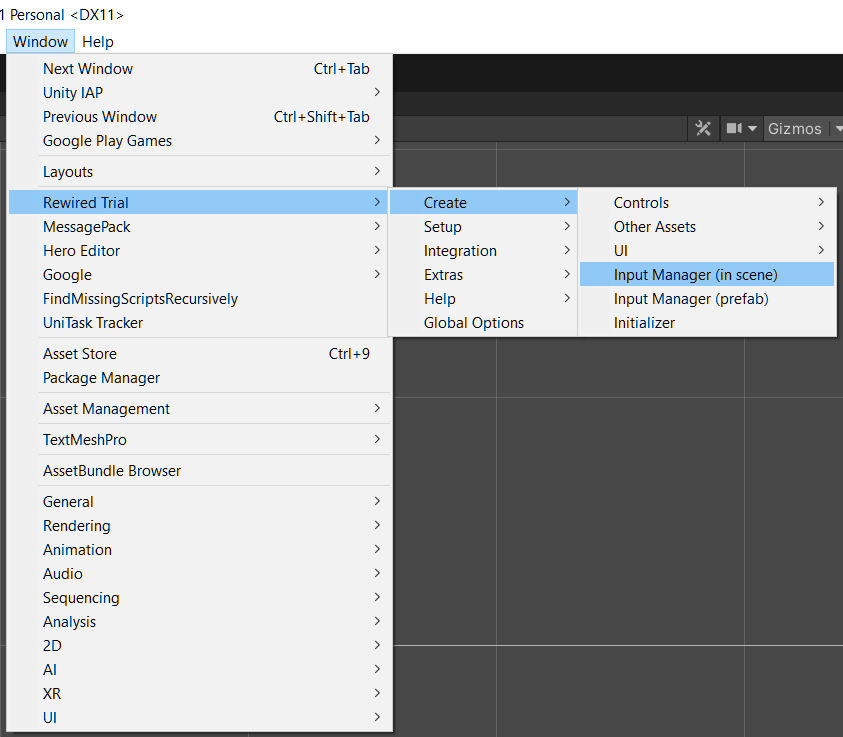
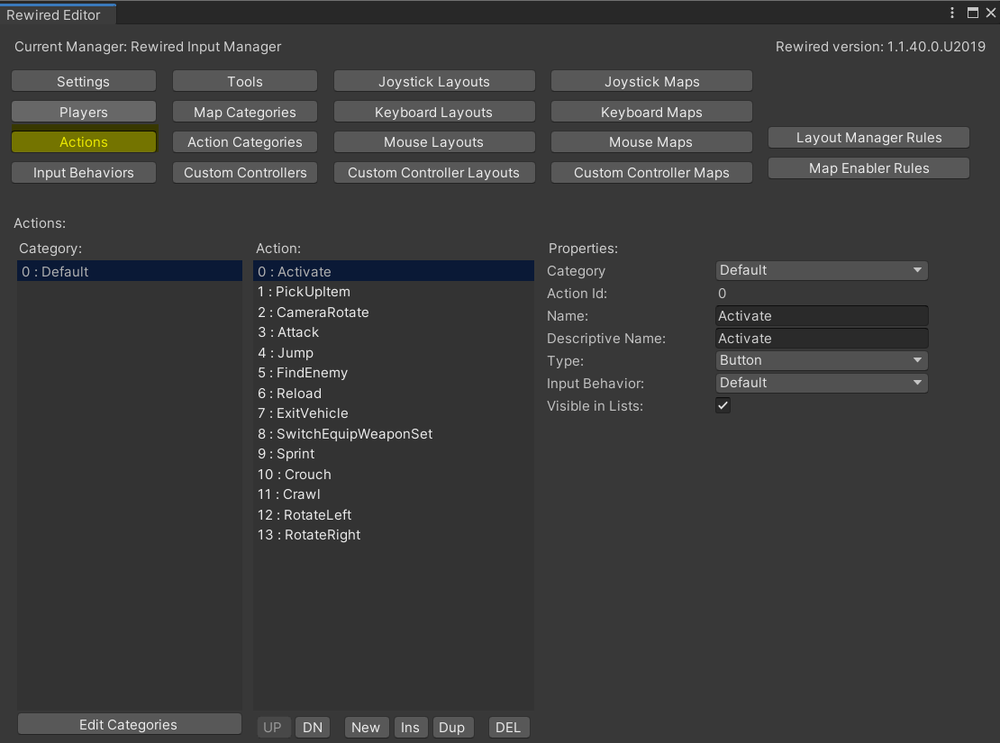
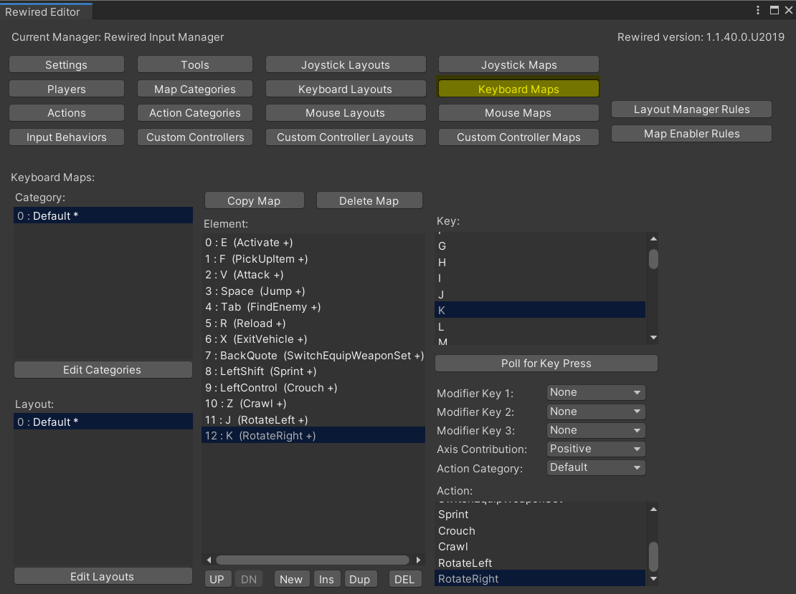
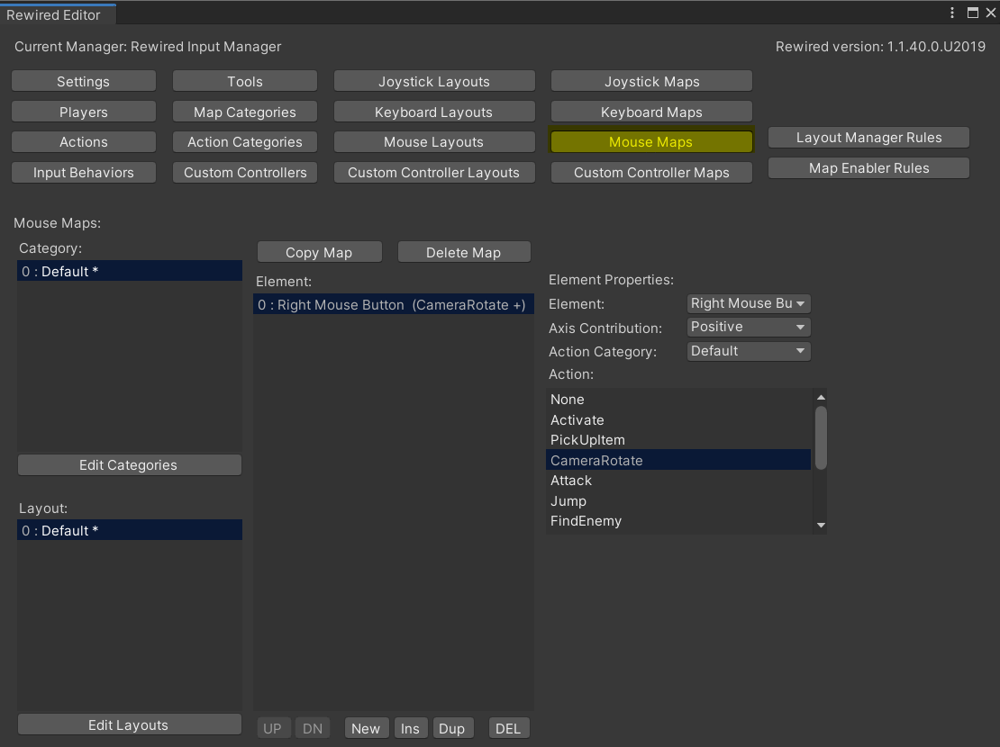
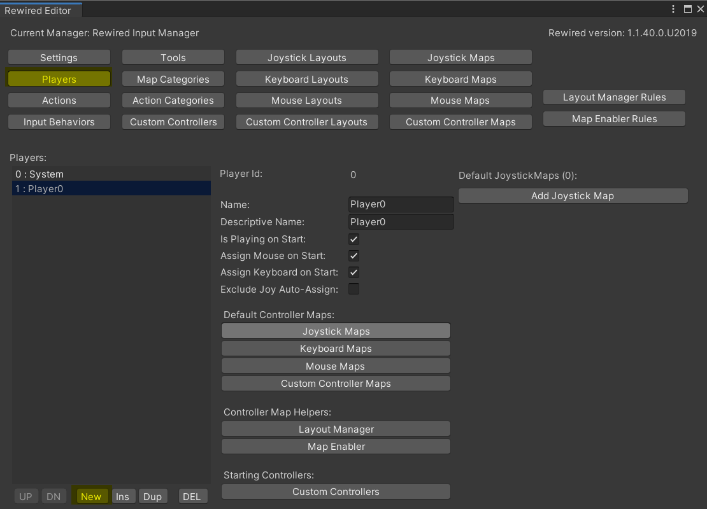
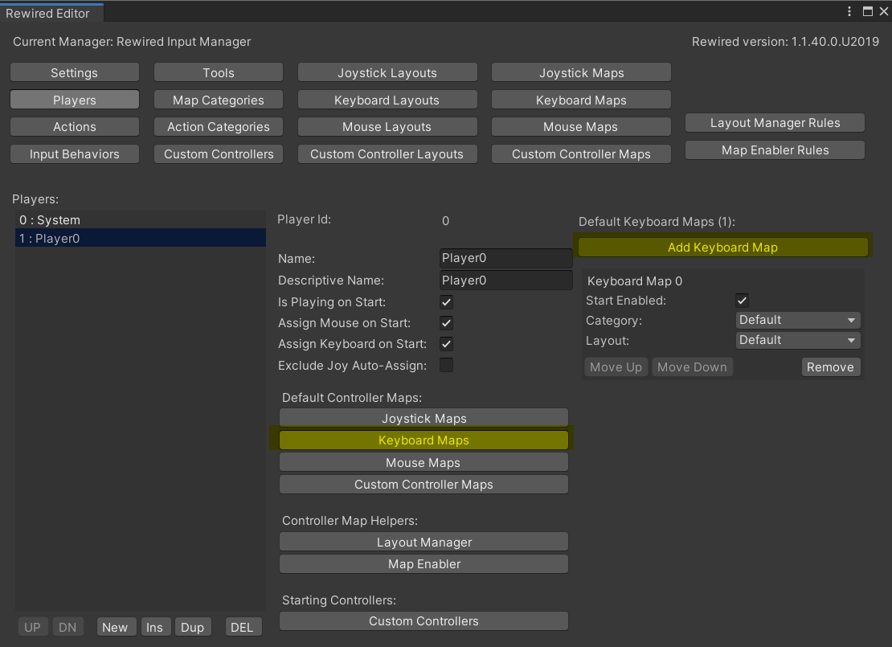
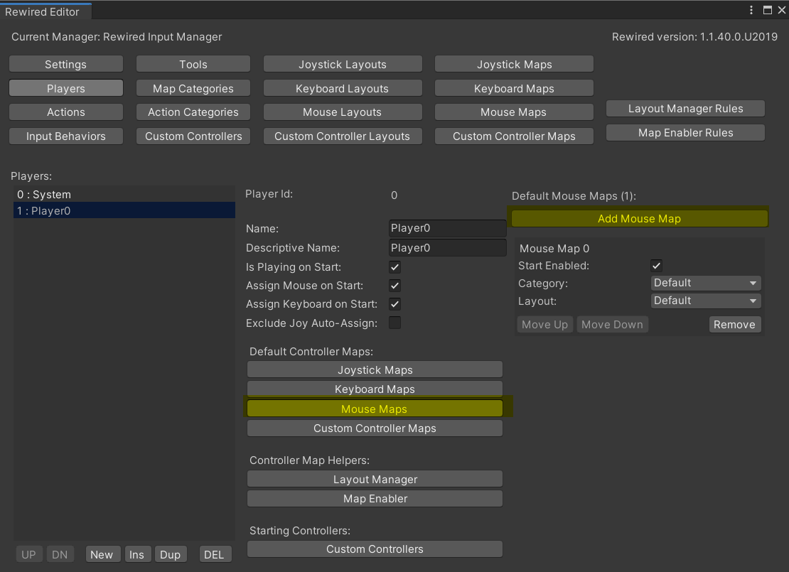

# UnityMultiplayerARPG_TestRewiredIntegration
Just a Rewired integration testing content

* * *

In the last update, I have improved [InputManager](https://github.com/insthync/unity-camera-and-input) to make it work with [Rewired](https://guavaman.com/projects/rewired). So if you buy Rewired later, and you want to switch input system to Rewired you have to add `USE_REWIRED` to scripting define symbols setting.

For getting started, you have to add Rewired's input manager to init scene from menu

Add an actions

Add default keyboard layout

Add default mouse layout

Add player

Set keyboard layout to the player

Set mouse layout to the player

And.. You also can remove `InputManagerSetting` which usually attached to the Game Instance in the demos.